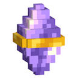
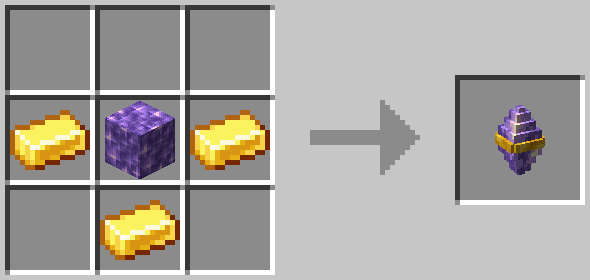
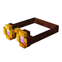
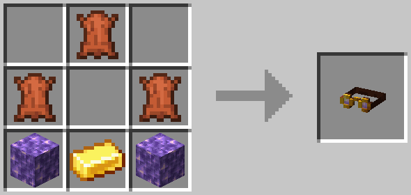
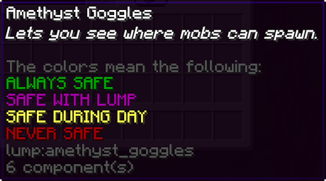
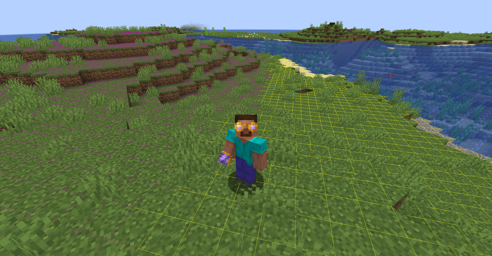
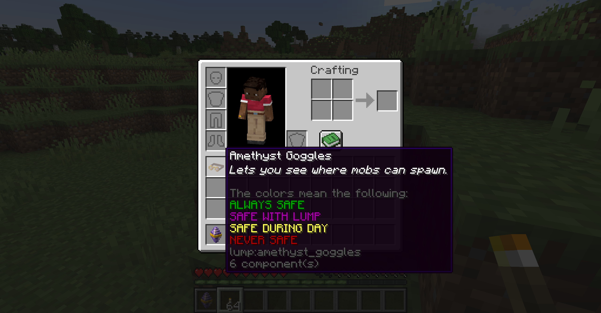
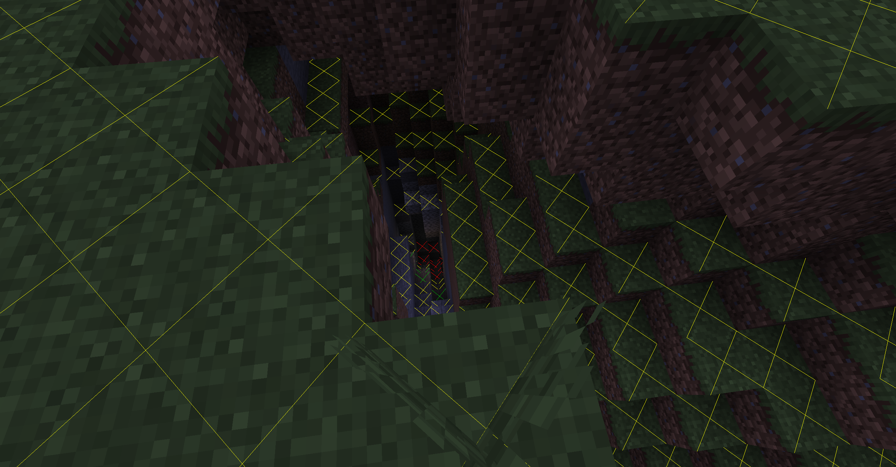
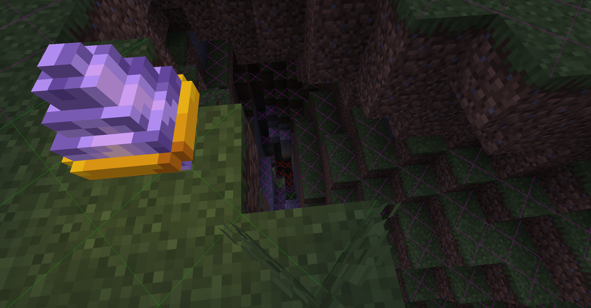

# Less Ugly Mob-Proofing
  
LUMP aims to **eradicate torch spam** around your base,  
_**without affecting your mob grinders**_ or other farms.

It achieves this by **adding a craftable block**, called the [_Amethyst Beacon_](#amethyst-beacon), which blocks mob spawns within its range,  
_but only for blocks that would be otherwise safe during the day (it is **skylight based**)_.

This means:  
✅ you **only need to light up the interiors** of your base  
✅ your **mob farms should still work** _(as long as they are dark)_  
✅ **caves are still dangerous** until you light them up  

✨ This mod also includes a color-coded **light overlay** to see which blocks are spawnable and which are safe,  
the overlay is always displayed when you have the _fashionable_ [_Amethyst Goggles_](#amethyst-goggles) equipped on your head.

⛏️ **This mod aims to be 100% survival friendly.**

## Added blocks & items
### Amethyst Beacon
  
Prevents most hostile mob spawns within it's **range of 128 blocks** (horizontally[*](#beacon-range)) from where it is placed .

You can **craft** Amethyst Beacons from:
- 1 Block of Amethyst
- 3 Gold Ingots

### Amethyst Goggles
  
These goggles add a color-coded light overlay to the game, in an immersive & survival friendly way.

You can **craft** Amethyst Goggles from:
- 2 Blocks of Amethyst
- 3 pieces of Leather
- 1 Gold Ingot

_They do not stack, but can be equipped on the head._

When advanced tooltips are enabled (F3 + H), the item shows **the legend for the light overlay:**

## Technical Details
#### Beacon Range
The range of the beacon is calculated horizontally, the height (y axis) is ignored.  
(This effectively means that the _"Area of Effect"_ for the beacons is shaped like a cylinder.)
#### Dimension Support
The beacons should work fine in _any dimension with skylight_, this means that out of the vanilla dimensions **the mod is only effective in the overworld**.

Two fields of the [Dimension Type](https://minecraft.wiki/w/Dimension_type#Defaults) structure are relevant for this mod,  
the _monster_spawn_block_light_limit_ is taken into account for spawn blocking,  
and as mentioned before _has_skylight_ must be **true** for the beacons to have an effect.
#### Light Overlay Accuracy
The light overlay tests blocks for Creeper spawns specifically, this should be accurate for the vast majority of mobs in minecraft,
but there might be some special cases here and there.

## Gallery
  
  

